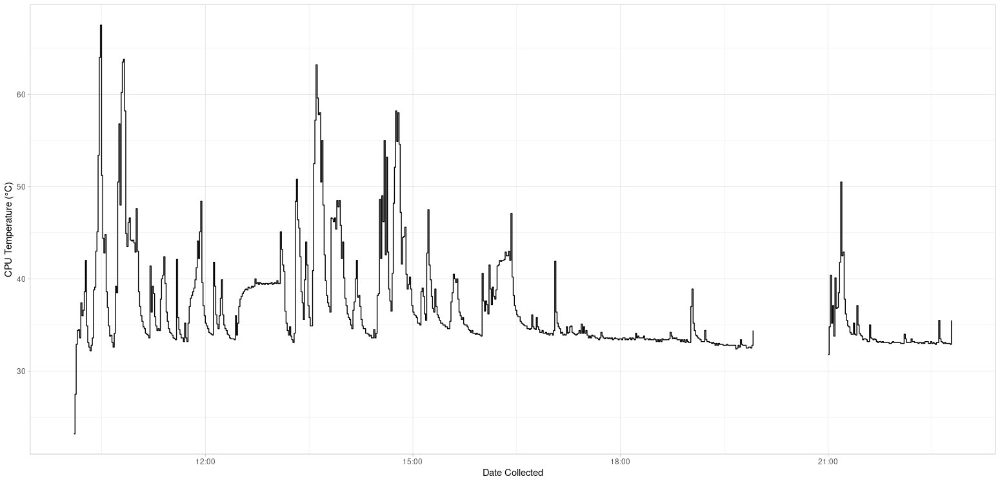
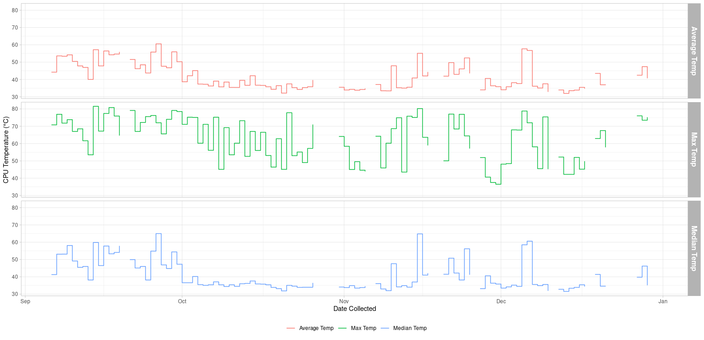

# Plotting CPU Temperature
`CPU Temp Script.R` generates plots using CPU temperature output from osx-cpu-temp in R with ggplot2

CPU Temperature by Minute

CPU Temperature Average, Max, Median by Day

osx-cpu-temp:
https://github.com/lavoiesl/osx-cpu-temp
